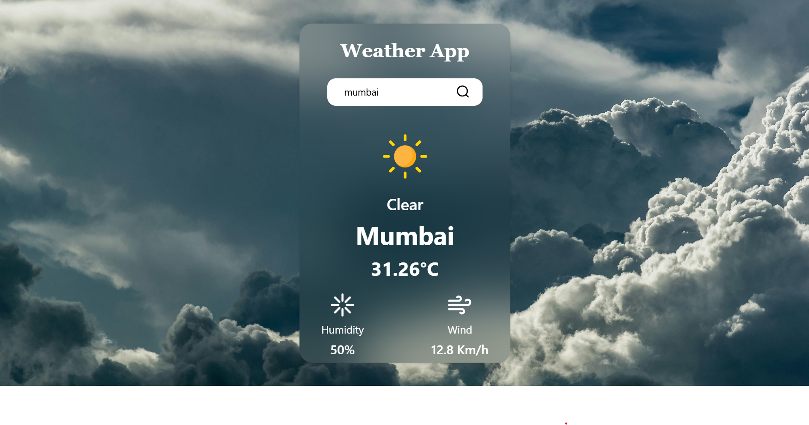

# Weather App 🌦️

A simple and responsive weather application that shows real-time weather information using a public weather API.

## 🌐 Features

- Search for any city to view current weather
- Displays temperature, weather condition, and location
- Fetches real-time data using OpenWeatherMap API
- Responsive design for all screen sizes
- Built with HTML, CSS, and JavaScript

## ⚙️ Technologies Used

- HTML
- Tailwindcss
- JavaScript
- [OpenWeatherMap API](https://openweathermap.org/api)

## 📸 Screenshots

Here is a preview of the Weather App:



## 🚀 How to Run the App

1. Clone the repository:
   ```
   git clone https://github.com/your-username/your-repo-name.git
   ```

2. Open `index.html` in your browser.

## 📌 Note

- You need an API key from OpenWeatherMap.
- Replace the placeholder API key in the JavaScript file before using the app.

## 🙌 Author

- [Ansari Soman](https://github.com/Ansari-Soman)

---

Feel free to use this project for learning or personal use!
